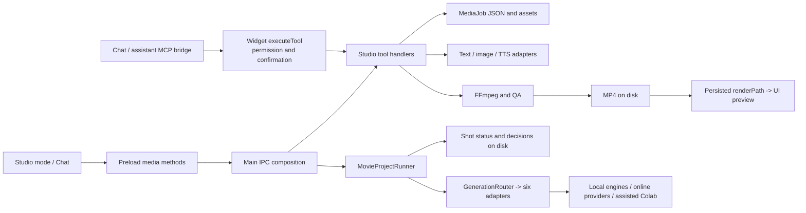

# HB-M0 — Core and Production Studio baseline

Measured on Windows on 2026-09-08 for the
[locked Notion Core + Modules / Media Studio M2 plan](https://app.notion.com/p/3d5829ebf7be8150abd0f56e4d00083d).
This records existing mechanisms and the next migration seams. It introduces no
new runtime framework. The [media acceptance gates](MEDIA_STUDIO_PLAN.md) remain
required; source presence and mocked tests do not establish real-media success.

## Reconciled checkpoint

HB-M0 completed on 2026-09-08: #259 merged as `8327342`, including #260 and #262.
The entire merged tree matches the tested `4c4e6ee` tree. All six required
contexts were present and green; the nine-shard Electron matrix passed, with
Windows running 16 + 16 + 15 actual tests. Root CI ran 219 tests and Windows
application CI ran 3,682 unit tests plus 13 overlay tests. Local full Electron
baseline: 47 passed without retries. See the
[matrix run](https://github.com/kingithegreat/Sadie/actions/runs/34217979784) and
[application/root run](https://github.com/kingithegreat/Sadie/actions/runs/34217979661).
The historical reconciliation and measurements below remain pinned to that
baseline; the successor host contract is [CORE_MODULE_CONTRACT.md](CORE_MODULE_CONTRACT.md).

Main `0c85650` contains the #260 overlay repair and #262 Windows E2E launcher
repair. Both PRs are merged. #259 at `cede545` contains the pending storyboard,
script director, FFmpeg storyboard renderer, ComfyUI adapter, DCC/timeline and
feed-library work. Integration checkpoint `85203a5` preserves that work and both
main fixes. Only `CLAIMS.md` conflicted. The existing checkout and other agents'
worktrees were not changed.

The pending PR also carried 20 generated files in `movie/imhotep-temple-01`,
including MP4s, completed status/decision logs and machine-specific absolute
paths. They are excluded from Git and `/movie/` is ignored; every file remains
on disk in the integration worktree and the original checkout. Repository-wide
search found no production/test filesystem caller; tests build their own temp
fixtures. Production project discovery uses `~/Desktop/homebot-movie-projects`.
The portable format remains documented in `widget/src/main/movie/MOVIE_PROJECT_STRUCTURE.md`.

The controller/documentation #261 remains a separate draft; it is not a customer
runtime dependency. HB-M0 is owned by Codex on `claude/studio-m0-baseline`, with
the integration delivered through the existing #259 branch. Remote verification
and final measurements are recorded below before handoff.

## Existing authority and proposed ownership

| Concern | Actual mechanism and source | Ownership / smallest migration seam |
|---|---|---|
| Desktop startup | `widget/src/main/index.ts:168` opens startup; IPC/window at 233–249, supervisor/bridge at 332–404, tools/scheduler at 437–448. | Core composition root. Keep startup independent of an enabled Studio, using bounded activation and cleanup. |
| Runtime tool dispatch | `widget/src/main/tools/index.ts:85` holds the Map; `registerTool` at 109 silently replaces an existing name; `executeTool` at 509 checks permission/confirmation and records outcome. | Core wraps this live authority with module ownership, collision rejection and unregister. Preserve legacy tool names as aliases. |
| Root registry | `src/toolRegistry.ts:88` implements a separate registry with schema/entitlement logic. No production widget import was found; root tests exercise it. | Reuse pure policy functions where appropriate; do not assume adding a guard here protects desktop dispatch. |
| Navigation and UI | `shared/modes.ts:7`, `shared/navigation.ts:26`, `renderer/components/StatusIndicator.tsx:329` and `renderer/App.tsx:25` contain static mode lists, labels and lazy imports. App mounts Studio at 1564. | Core shell consumes trusted UI contributions; Studio owns its registered view. Lazy loading already exists; lifecycle removal does not. |
| IPC/preload | `main/ipc-handlers.ts:149` is monolithic; Studio starts at 818. `preload/index.ts:753` exposes media methods; `shared/types.ts:506` types the surface. | Retain channel compatibility behind a trusted Studio composition adapter. Check dispatch in main; renderer flags are not authority. |
| Permissions | `tools/index.ts:527` and `config-manager.ts:431` enforce current tool permissions; confirmation follows at 540. | Core authority shared by UI, chat, MCP and resumed jobs. Studio IPC directly invokes handlers today, so it must join the same path. |
| Entitlements | `main/licensing.ts:1` bridges root licensing; `src/entitlements.ts:34` contains current Free/Pro grants. Automation has IPC wrappers at `ipc-handlers.ts:2013`; media has no module grant. | Extend existing signed-license authority later. Preserve issued rights; no new paid gate or sales in M0. |
| Secrets | `config-manager.ts:30` and 626–739 use Electron safeStorage for scoped secret maps. | Core credential service; provider adapters request only their authorized scope. No second secret store. |
| MCP lifecycle | `mcp-client.ts:152` initializes configured servers; 235–288 registers prefixed tools; 473 shuts down; 507 disconnects one server. | Existing adapter lifecycle to wrap. Closing clients currently cannot unregister their tool handlers. |
| Scheduled automations | `scheduler.ts:52–64` persists `scheduled-jobs.json`; 120–143 reloads timers. | Core scheduling foundation, not a durable media execution record. File watcher disposal at 388 has test callers but no app-quit caller. |
| Service health | `index.ts:332` starts the shared supervisor; `src/supervisor/supervisor.ts` handles health/recovery. | Core health service. It does not checkpoint or resume a media stage. |
| Media domain state | `media-studio.ts:22` and 106 define stages/transitions; `tools/media.ts:75–80` atomically persists `media-jobs.json`; assets live under `media-assets/<job>`. | Studio keeps domain schema and QA. Core adds a versioned run envelope around the existing persistence. |
| Movie shot state | `movie/project-runner.ts:286` loads status, 294 skips completed shots, 311 detects deferred output and marks it generated, 369 writes PROMPTED before dispatch. | Studio shot records remain compatible; a Core run owns leases, idempotency, cancellation, recovery and trace identity. |
| Provider interface | `movie/types.ts:47` defines capabilities/requests and 96–101 defines probe/generate; `movie/router.ts:44` registers providers, 61 ranks, 117 runs fallbacks. | Keep providers as replaceable adapters. Add policy/resource eligibility before probes or generation; cost-only `freeOnly` is not online consent. |
| Provider composition | `movie/project-runner.ts:82` registers Ancient Pathways, Colab, ComfyUI, Pollinations, Imagen and local SD. Media research/script text uses `media-generate.ts:37–200`; ordinary media scene images call `imageGenerateHandler` at `media-visuals.ts:175–182`. | Studio composition adapter connects the existing paths; avoid a fourth independent generation pipeline. |
| External workers | Ancient Pathways local Python showrunner (`ancient-pathways.ts:576–633`), Colab ticket/notebook, FFmpeg processes and optional TTS engines. | Adapters with explicit availability. Keep personal series, installed engines and user assets outside Core source; the generated root sample is excluded in this checkpoint. |
| Packaging | `widget/package.json` includes built output and selected config/workflow resources; engines/models are not a separately managed module package. | Independent optional installation, package integrity and schema rollback remain HB-M3 work. |

All widget paths in this table are under `widget/src/` unless qualified with
`widget/` or root `src/`. Line references describe the integrated snapshot.

## Dependency graph and real user paths

The direct IPC-to-handler edge is an authority split to remove, not a proposed
new bypass. Trace the actual paths when adding host checks:

1. **Make video:** `MediaStudioPanel.tsx:1688` → preload `mediaRun` at 759 →
   `homebot:media:run` at `ipc-handlers.ts:885` → `media_render` handler at
   `tools/media.ts:741` → optional scene generation, `renderVideo`, QA and saved result
   at 809–924 → list refresh at `MediaStudioPanel.tsx:433` → file player at 1549.
   `media-render.ts:456` launches FFmpeg with a timeout and checks the output.
2. **Chat idea handoff:** `App.tsx:1205` creates a media job via preload, carries
   its ID in navigation context, and opens Studio. This is a production caller.
3. **Movie project:** Studio's router workspace → `mediaMovieRun` →
   `homebot:media:movie:run` → `MovieProjectRunner.runProject` → provider router
   → shot files and report. A report is generation state, not an assembled movie.
4. **Storyboard:** create/list/get/frame IPC invokes `tools/media-storyboard.ts`
   handlers (`ipc-handlers.ts:1279–1300`); save is implemented inline at 1302–1337.
   Render IPC directly invokes `movie/storyboard-renderer.ts` at 1339–1368;
   breakdown directly invokes `movie/script-director.ts` at 1370–1380.
   FFmpeg assembles segments and a final movie. Editing persistence and
   exported-frame changes still need their media acceptance test.

## Proven gaps to carry into the next milestones

- **Module lifecycle:** no common descriptor, owned registrations, unregister,
  activation rollback, dependency compatibility or removable UI contributions.
  A Map and an MCP server connection are foundations, not a finished host.
- **Dispatch:** Studio run/delete IPC calls domain handlers directly. Chat/MCP
  uses `executeTool`. Enable/disable and permission gates must cover both, along
  with worker resumption. Preserve existing publishing kill-switch checks.
- **Durable runs:** MediaJob has no run attempt, input idempotency, cancellation
  signal or resource lease. Stage work is saved after execution. Movie shots
  persist PROMPTED before generation but have no project lock, retry ceiling or
  atomic status write; completed/deferred output is accepted by state/existence.
- **Provider policy:** movie routing combines request policy/reference fields
  with provider-reported cost, watermark and availability capabilities, but
  has no authoritative privacy decision. Probe and fallback
  need a shared authoritative online-consent decision, reusing/extending
  `resolveCloudLLM` / `useCustomLLM`. There is no current widget `allowCloud`
  symbol; preserve the plan's fail-closed intent. Edge narration is online too.
- **Output trust:** `tools/media.ts:887–900` treats unavailable QA measurements as
  warnings and can accept the result. Movie completion does not verify usable
  assets. `tools/narrate-clip.ts:196` passes the analyzer script to a two-argument
  helper without the required input video (source-level expected failure).
  These remain media tasks 2/3, not fixed by M0.
- **Observability:** tool duration/outcome logs and per-shot routing JSONL exist.
  A shared causal trace, redacted errors, budgets, approvals and circuit-breaker
  events do not yet span these independent paths.
- **Optional startup:** n8n startup is asynchronous, but domains are registered
  together. E2E stubs do not prove a production start with absent dependencies.
  Studio-disabled, zero-outbound and actual worker-failure checks remain HB-M2.

HB-M1 should introduce the thin trusted host around the existing widget registry,
registered Studio facade and narrow services. Common persistent-run contracts
must wrap MediaJob/shot state as the locked M2 build order requires; Studio owns
ShotSpecs, editor and QC. Preserve names/paths through compatibility adapters
with owner and removal gate. Do not add another scheduler or licensing authority.

## Verification and measurement

Local Windows host: Node 24.13.0; CI uses Node 22. Dependencies were reused from
the installed root and widget packages through worktree-local junctions; no
dependency or lockfile changes. Native Jest fixtures require normal Windows
home-directory access.

| Check | Measured result |
|---|---|
| Root / widget TypeScript | Both pass |
| Root Jest | 17 suites, 219 tests passed |
| Widget Jest | 264 suites, 3,682 tests passed; 5 suites / 15 tests skipped; exit 0 |
| Widget lint | 0 errors, 8 pre-existing hook warnings |
| Electron build | Pass after esbuild's sandbox directory-access denial was resolved by running with normal filesystem access |
| Docs contract | 201 preload methods, 151 renderer-to-main and 32 main-to-renderer channels in sync |
| Duplicate exports | Six new source files inspected, no collisions |
| Real Electron | 47 passed in 13.2 minutes, no retries; fresh profiles against the rebuilt app |
| Remote CI | Pending final integration push; every required context must be present and green |

The first widget run passed assertions but failed to save JSON to a missing
directory. A rerun using the ignored `widget/jest-result.json` completed with
exit 0; its actual result is the table above. Test output directories must not
be shared with a concurrent Playwright run, which clears its artifact directory.

Relevant committed tests: root `src/__tests__/widget-e2e-workflow.test.ts`;
widget main `__tests__/media-studio.test.ts`, `media-tools.test.ts`,
`project-runner.test.ts`, `movie-router.test.ts`, `mcp-client.test.ts`,
`ipc-invoke-contract.test.ts`; renderer `__tests__/media-studio-render-action.test.tsx`,
`media-studio-preview.test.tsx`, `media-studio-storyboard.test.tsx`; actual Electron
`renderer/e2e/overlay.e2e.spec.ts` and `visual-check.e2e.spec.ts`.
Environment-gated live media tests are not counted as provider acceptance.

Run the repeatable measurement after building and after other test workloads
finish: `node scripts/measure-studio-baseline.cjs`. It opens Studio from three
fresh profiles and writes screenshots plus `widget/test-results/m0-baseline/metrics.json`.
It uses the normal rendered UI with E2E service stubs. Startup is launch-to-hydrated
renderer, followed by onboarding dismissal and Studio opening. Memory is a
per-process sample and sum of working sets; shared pages may be counted twice.
Electron reports these values in [KB](https://www.electronjs.org/docs/latest/api/structures/memory-info).

Measurements from Electron 42.8.1 (embedded Node 24.18.1), Windows 10.0.26200,
x64, 16,866,664,448 bytes of installed RAM. Full values and versions are in the
[recorded measurement](evidence/studio-m0-baseline.json); three actual runs
completed with exit 0. The source is integration `85203a5` with only the baseline
documentation/tooling uncommitted. The Studio screenshot was visually inspected.

| Fresh profile | Renderer ready | Open Studio | Shell summed working set | Studio summed working set |
|---|---|---|---|---|
| 1 | 1,922 ms | 1,433 ms | 604,616 KB | 719,144 KB |
| 2 | 3,798 ms | 1,638 ms | 605,696 KB | 715,048 KB |
| 3 | 3,656 ms | 860 ms | 689,776 KB | 706,964 KB |

Uncompressed build output: 28,201,032 bytes; the lazy Studio JavaScript chunk:
216,687 bytes. These exclude installed dependencies, model caches and installer
compression; they are not an independently installable Studio size.

For the next host-only change, use these observed maxima plus 25% headroom as
provisional investigation thresholds on this same machine and test mode:
renderer 4,750 ms, Studio opening 2,050 ms, summed Studio working set 899,000 KB.
A repeated exceedance requires diagnosis before accepting the migration. These
are comparison budgets, not shipped performance promises or GPU-job limits.
Repeat the three-run measurement without concurrent builds/tests for comparison.

No independently installable Studio package exists to measure yet. No expensive
real-media/provider run was performed, so job peak memory remains unmeasured.
Do not substitute idle shell memory for a 4 GB GPU workload guarantee. Measure
the actual media job after the privacy/output repairs, before setting its limit.
Fresh install, crash recovery, live providers, publication, resource isolation
and the full M2 pilot remain open acceptance gates.
